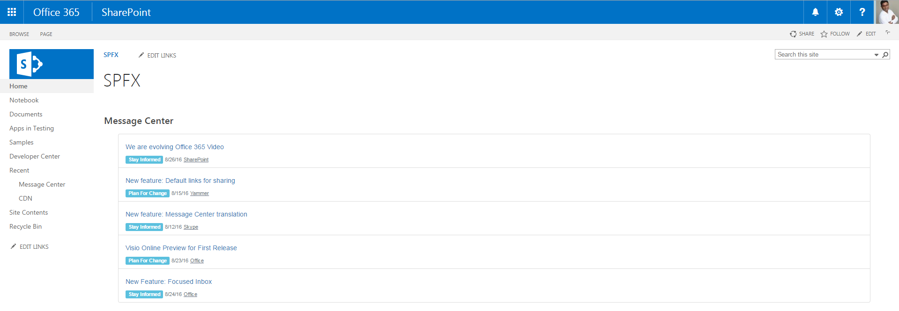

# spfx-messagecenter-webpart using Angular & Bootstrap

## Summary

Sample Web Part illustrating using Angular and Bootstrap with the SharePoint Framework.
You can find the walk-through of this sample from [SPRIDER](https://blog.sprider.org/2016/08/29/simple-angular-webpart-using-sharepoint-framework-preview/).

## Applies to

* [SharePoint Framework Developer Preview](https://github.com/SharePoint/sp-dev-docs/wiki)
* [Office 365 developer tenant](https://github.com/SharePoint/sp-dev-docs/wiki/Setup-SharePoint-Tenant)

## Solution

Solution|Author(s)
--------|---------
spfx-messagecenter-webpart|Joseph Velliah (SPRIDER, @sprider)

## Version history

Version|Date|Comments
-------|----|--------
1.0|September 06, 2016|Initial commit

## Disclaimer
**THIS CODE IS PROVIDED *AS IS* WITHOUT WARRANTY OF ANY KIND, EITHER EXPRESS OR IMPLIED, INCLUDING ANY IMPLIED WARRANTIES OF FITNESS FOR A PARTICULAR PURPOSE, MERCHANTABILITY, OR NON-INFRINGEMENT.**

---

## Minimal Path to Awesome

- clone this repo
- in the command line run:
  - `npm i`
  - `tsd install`
  - `gulp serve`

## Features

The Message Center Web Part is a sample Client-Side Web Part built on the SharePoint Framework built using Angular and Bootstrap.

This Web Part illustrates the following concepts on top of the SharePoint Framework:

- using Angular for building SharePoint Framework Client-Side Web Parts
- using Bootstrap for styling Angular Client-Side Web Parts
- including Angular and Bootstrap in the Web Part bundle
- using a newer version of Bootstrap for styling Client-Side Web Parts
- using non-reactive Web Part Property Pane and custom Properties
- using conditional rendering for one-time Web Part setup
- passing Web Part configuration to Angular and reacting to configuration changes

